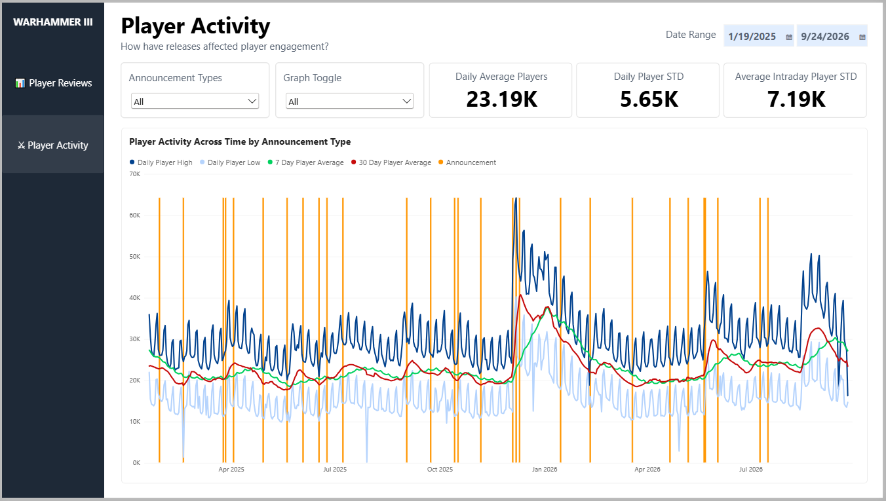
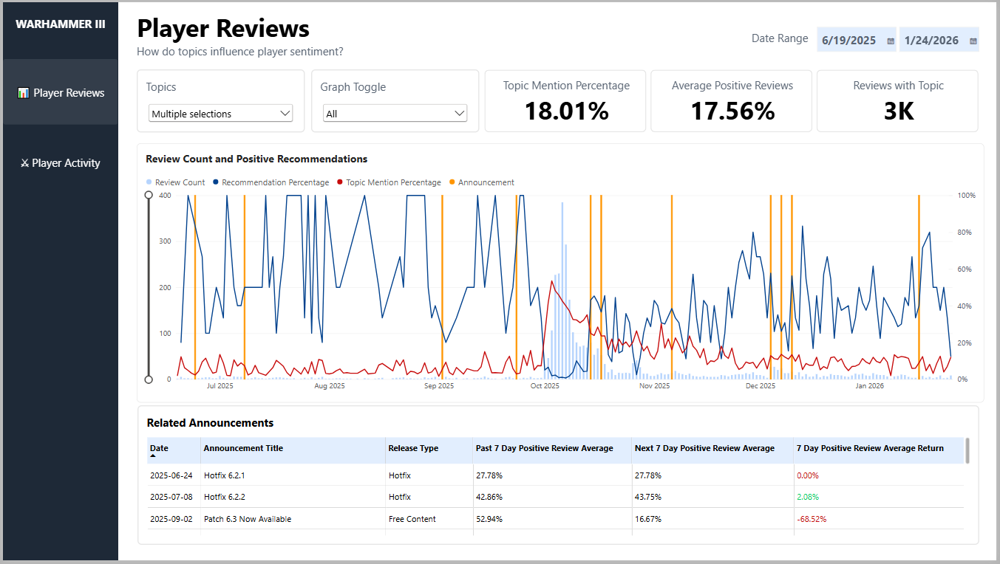
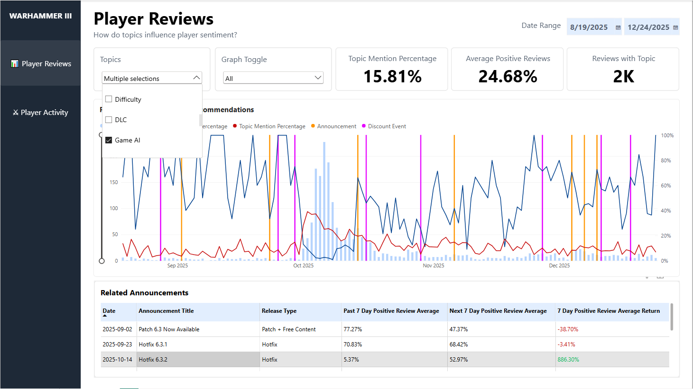
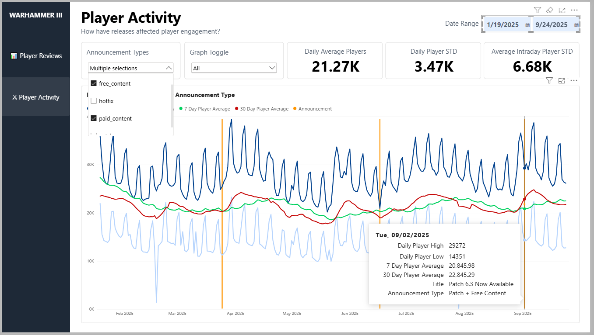

# Total War: WARHAMMER III — Review Analysis with Power BI

Analysis of Steam review sentiment, review topics and player response
to game updates.

- API data collection with Python
- Review topic classification
- Power Query data transformation
- DAX measures for analytics and visuals
- Release analysis of player Sentiment and Engagement

## ANALYSIS

This project examined Steam player reviews from 2024-2026, historical data from games-popularity.com, and steamdb for developer announcement information. ChatGPT Plus then ingested CSV files that contained 50k+ text to organize common topics for further comparison. 

After data collection the project then focused on two findings:

- Reviews and Announcements by topic including player positive recommendations
- Player activity before and after game releases by the type of an Announcement

## DASHBOARD

### Player Review

The report cross analyzes the topics in player reviews, and similar topics in announcements. It then shows how the announcements affect on player sentiment by giving a positive recommendation as a line that relates to the review count shown by columns. 

This dashboard contains a date range for the graph, a dropdown menu to sort by topics, another dropdown for line graph visibility toggle, 3 cards presenting larger data points about selected topic within the range, the main graph showing player review counts + recommendation percentage and a table for a list of announcements for more details.

Example of the graph filtering to a date range, and for the topics "campaign" and "ai." The table below exposes details that Hotfix 6.3.2 experienced an increase in positive reviews over the next 7 days after a significant drop 7 days prior to the hotfix: 5.37% -> 52.97%

### Player Activity

On this report page the direct engagement of players in relation to announcements is analyzed. The measurement of player activity helps to show which types of announcements influence engagement by presenting daily highs, daily lows, 7 Day Averages and 30 Day Averages.

The dashboard allows filtering by date range, announcement types from a dropdown, a graph visibility toggle, 3 cards based on the date range to show daily average players + daily player STD + Intraday player STD and the line graph displaying player activity across time.

With a narrow date range the weekly periodic activity can be observed and this graph filters free + paid content that also shows the tooltips for one patch with free content with a spike of activity in the dip of the week.

## KEY FINDINGS

- Promotional events can lead to a higher volume of reviews that can be negative, so interpreting review sentiment to identify topics is crucial. This can be used to assist in targeting high-impact releases to recover sentiment over time.
- Player activity follows a weekly periodic pattern revolving around increased play on weekends and content related announcements sometimes disrupt the dip in that periodic activity. There may be an opportunity to provide shorter form content suitable for weekday play in order to raise the valley of the periodic.
