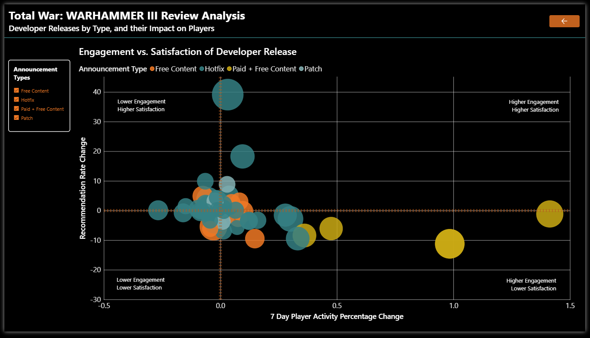
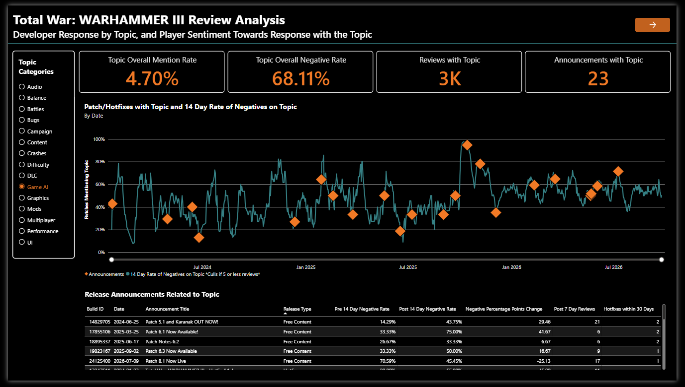
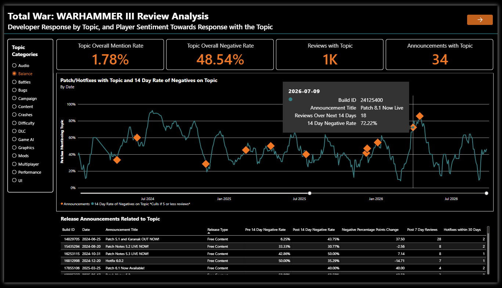
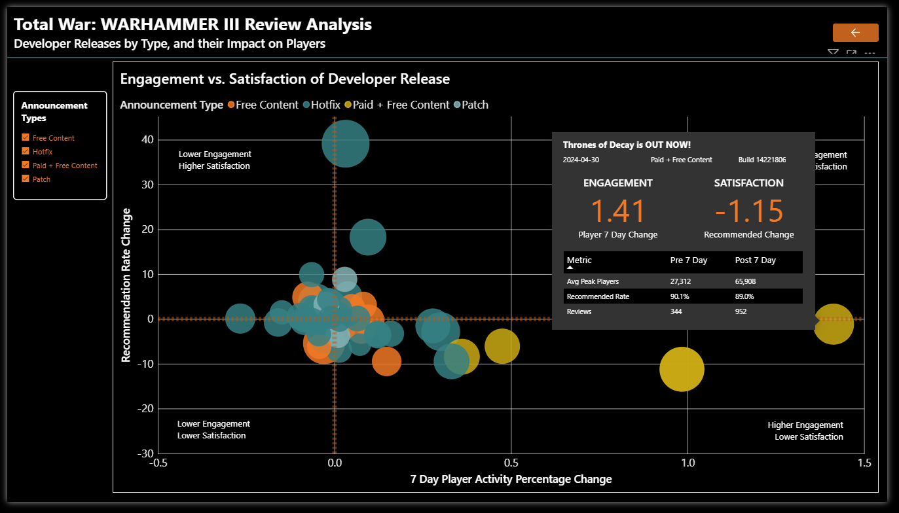
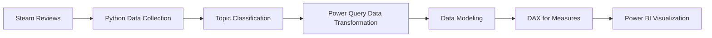

# Total War: WARHAMMER III — Review Analysis with Power BI

Analysis of Steam review sentiment, review topics, and player response
to game updates using Python and Microsoft Power BI.

## ANALYSIS

This project examines Steam player reviews from 2024-2026. It compares player sentiment, and engagement around developer announcements for releases.

The project focuses on two findings:

- Review topic prevalence, and recommendation rates
- Engagement vs. satisfaction before and after game updates

## DASHBOARD

### Review Topic Analysis

This dashboard contains a slicer to sort by topic, 4 cards presenting larger data points about selected topic, the main line graph showing announcement markets in relation to reviews, and a table for a list of announcements related to the topic for more details.

The dashboard itself allows adjustment to the X-axis timeline, and presents details when hovering over a data point.

### Engagement vs. Satisfaction

The four quadrant scatterplot starts by identifying announcements that can be filtered by type. It shows player interactions within a time period of the announcement either as a positive or negative for Player Engagement and Satisfaction.  Player's Engagement measures activity with the game, and player's Satisfaction uses player review metrics.

Examining a data point in detail shows a tooltip that highlights the values for Engagement/Satisfaction, while also expanding upon metrics 7 days before/after the specific announcement as a table.

## KEY FINDINGS

- A strong correlation of announcements with free + paid content, and increased player negative reviews, while also accounting for higher player activity
- Announcements for Patches moved the least amount of Engagement, while only marginally affecting player's review recommendation
- Developer releases involving Balance closely follows player negativity either as a peak (likely resolving negativity), or a valley (likely a causal factor to negativity).

## METHODOLOGY

For Topic Classification, ChatGPT Pro ingested a CSV file containing 50k+ text reviews, and Developer Announcements for the same topics noting their appearances. The topic "Other" was not included in Power BI Visualizations, but does account for a part of percentage totals. 

## CORE FEATURES

- Steam Review API data collection
- Review topic classification
- Power Query data transformation
- DAX measures for both analytics, and visuals
- Pre/post-release analysis
- Four-quadrant engagement/satisfaction analysis

## PROJECT FILES

- Power BI report (`.pbix`)
- Processed review dataset
- Python API fetchers
- Dashboard images

## TOOLS

Python · Power BI · Power Query · DAX · CSV/JSON · ChatGPT
