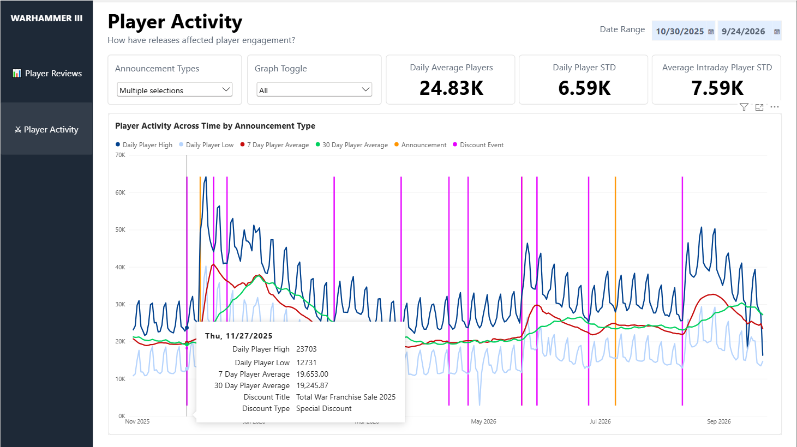

# Player Review and Activity Analysis for Total Warhammer 3 

I built this project to analyze player sentiment and activity in Total Warhammer 3, which just had its biggest release update. I wanted to focus on how reviews and player counts changed around developer releases.

Using Power BI, I combined Steam reviews, historical player counts and developer release data. This made it possible to compare trends in player feedback and engagement over time.

## Project Questions

- What patterns appear in player activity and reviews over time?
- How does player sentiment and engagement change around developer releases?
- How does player sentiment differ across common review topics?
- How much is player engagement affected by different types of announcements?

## TOOLS
- Power BI
- DAX
- Python

## Data

- Steam player reviews from 2024 through 2026: (https://store.steampowered.com/appreviews/1142710)
- Historical player activity data from games-popularity: (https://games-popularity.com)
- Developer announcements, discount events and release information from SteamDB: (https://steamdb.info/app/1142710/patchnotes/)
- LLM assisted topic filtering for player reviews

## Workflow

- Collected Steam review and player activity data through api with a Python script
- Cleaned and transformed the datasets within Power BI
- Used an LLM assisted process to identify common topics across +50,000 review texts
- Kept and organized recurring topics into their own columns
- Created DAX measures to compare review sentiment and player engagement
- Created an interactive Power BI report

### Player Review

I built the Player Review dashboard to look beyond the overall Steam rating and examine what players were actually discussing that included the following:

- Filter reviews by topic and date
- Compare review volume with positive recommendation percentage
- View developer announcements alongside review activity
- Compare sentiment before and after selected updates

One example "Hotfix 6.3.2" when filtering for Campaign and AI topics has the following:

- Positive recommendations in the previous 7 days: 5.37%
- Positive recommendations in the following 7 days: 52.97%

This implies the hotfix that addressed the player's feedback, and that it was received very positively over following the week.

### Player Activity

I also wanted to understand whether major updates and announcements were associated with changes in player engagement, so this dashboard includes the following:

- Daily player activity
- Daily highs and lows
- 7 day averages
- 30 day averages
- Announcement and release filters
- Comparisons between release dates and surrounding activity

## Key Findings

- Player activity follows a clear weekly cycle with stronger activity around weekends
  - Is there an opportunity here to improve engagement for the weekdays?
- Higher review volume does not always correspond with more positive sentiment
  - Does this reveal an issue in the QA process that results in negative player feedback?
  - How much does negative player feedback affect sales?
- Breaking reviews into specific topics provides more useful context than looking only at the overall review score
  - Are there any other topics or annoucements we can breakdown for analytics?
- Player Activity spiked around major discount events and major content releases
  - Is there way to strategically align your discounts to grow the player base?
  - Will that player base purchase subsequent content?

## Limitations

- Limited time span of data between 2024 to 2026
- The analysis is observational and does not prove that releases caused changes in sentiment or player activity
- Promotional events, seasonal effects, weekends, and unrelated events also influence the results
- LLM assisted topic classification can introduce inconsistent or ambiguous labels
- Steam reviewers may not represent the full player population
- Short analysis windows can overlap with other announcements or events
