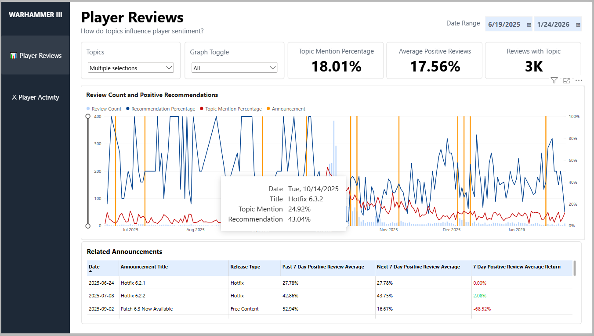
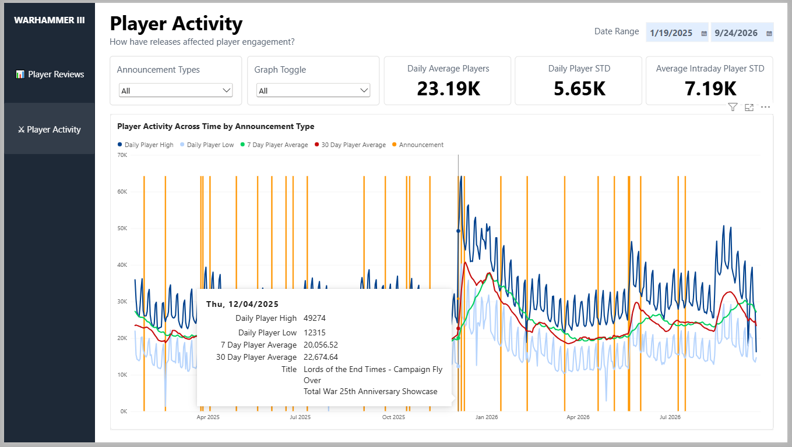

# Total War: WARHAMMER III — Review Analysis with Power BI

Analysis of Steam review sentiment, review topics and player response
to game updates using Python and Microsoft Power BI.

- API data collection
- Review topic classification
- Power Query data transformation
- DAX measures for analytics and visuals
- Release analysis of player Sentiment and Engagement

## ANALYSIS

This project examines Steam player reviews from 2024-2026, historical data from games-popularity.com, and steamdb for developer announcement information. ChatGPT Plus then ingests CSV files containing 50k+ text to organize common topics for further comparison. 

After data collection the project then focuses on two findings:

- Reviews and Announcements by topic including player positive recommendations
- Player activity before and after game releases by the type of an Announcement

## DASHBOARD

### Player Review Analysis

The report cross analyzes the topics in player reviews, and similar topics in announcements. It then shows how the announcements affect on player sentiment by giving a positive recommendation as a line that relates to the review count shown by columns. 

This dashboard contains a date range for the graph, a dropdown menu to sort by topics, another dropdown for line graph visibility toggle, 3 cards presenting larger data points about selected topic within the range, the main graph showing player review counts + recommendation percentage, and a table for a list of announcements for more details.

The graph itself allows adjustment to the Y-axis, and presents details when hovering over a column.

### Player Activity

On this page it analyzes the direct engagement of players in relation to announcements. The measurement of player activity helps to show which types of announcements influence engagement by presenting daily highs, lows, 7 Day Averages, and 30 Day Averages.

The dashboard allows filtering by date range, announcement types from a dropdown, a graph visibility toggle, 3 cards based on the date range to show daily average players + daily player STD + Intraday player STD, and the line graph displaying player activity across time.

Examining a data point expands to show specifics for that day.

## KEY FINDINGS

- A strong correlation of announcements with free + paid content, and increased player negative reviews, while also accounting for higher player activity
- Announcements for Patches moved the least amount of Engagement, while only marginally affecting player's review recommendation
- Some developer releases, such as those involving Balance, closely follows player negativity either as a peak (likely resolving negativity), or a valley (likely a causal factor to negativity)
